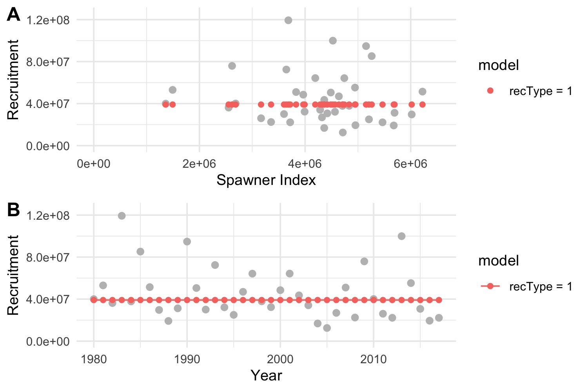
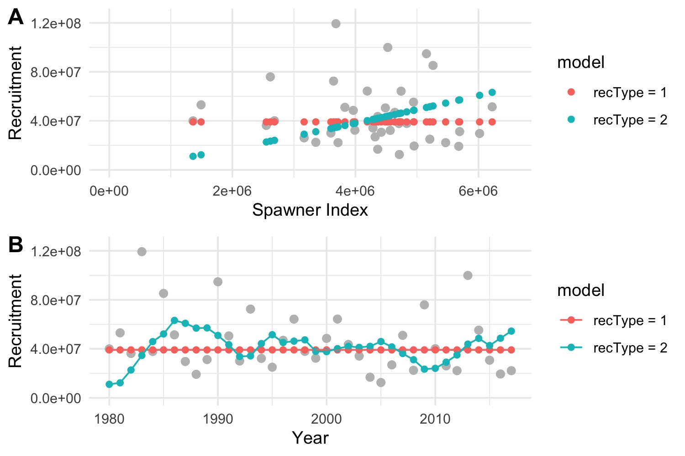
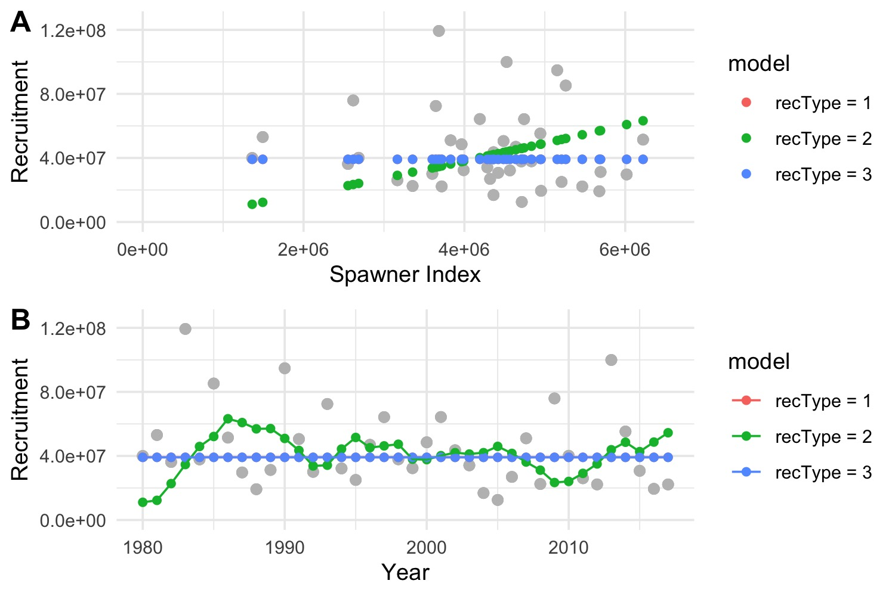
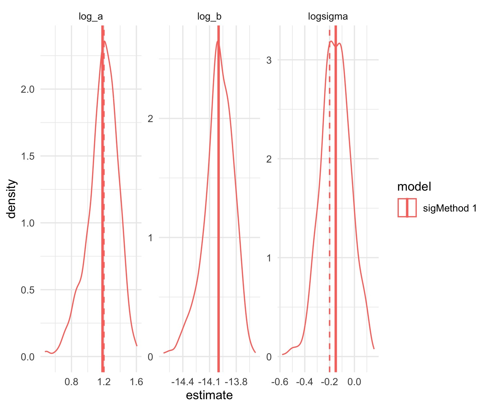
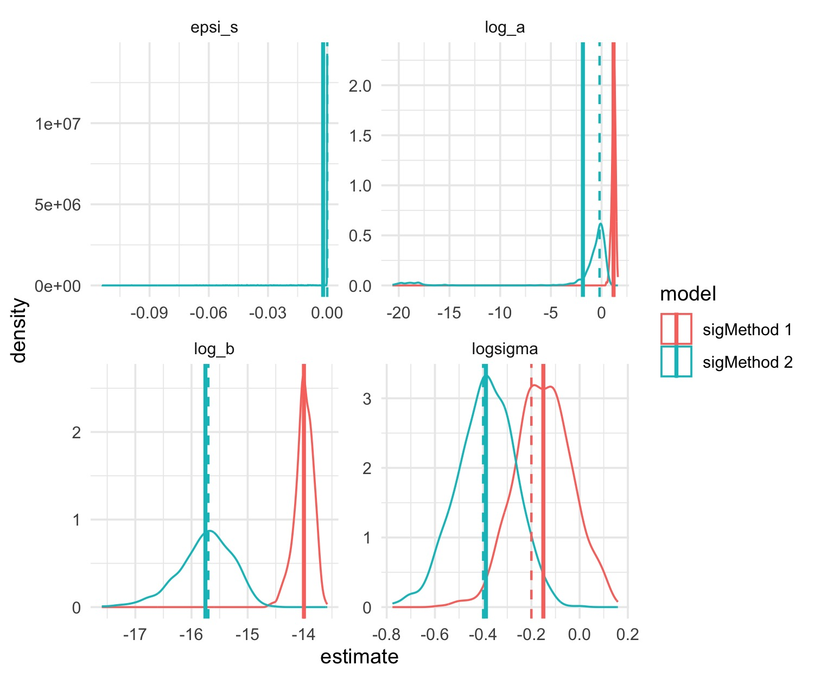
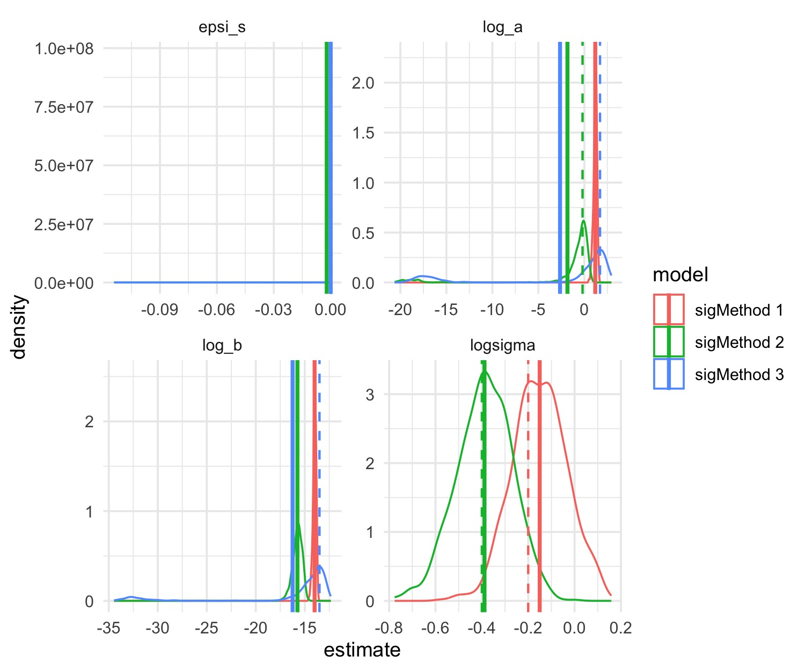
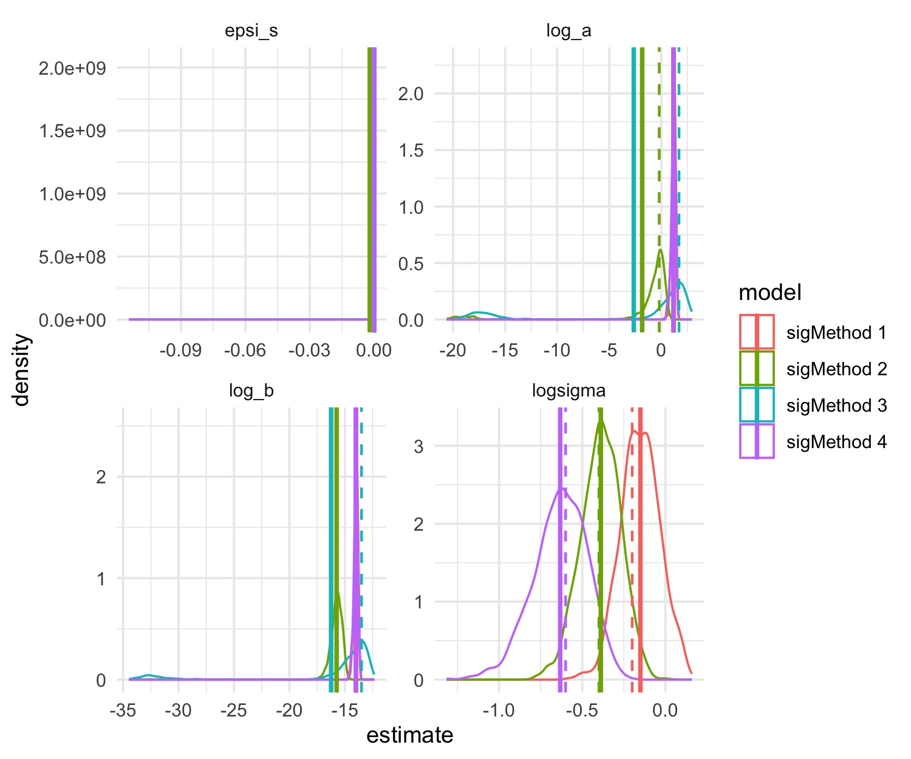
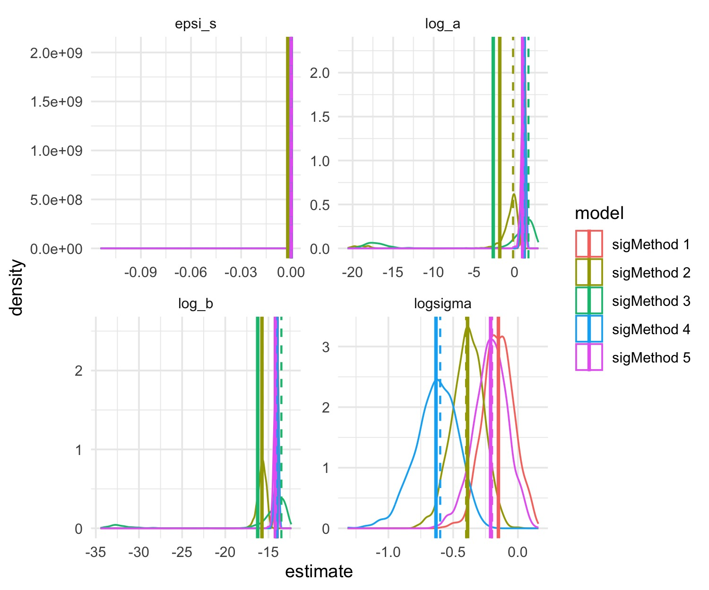

<!--   # html_notebook: -->
<!--   #   toc: TRUE -->
<!--   #   df_print: kable -->
<!--   #   fig_caption: yes -->
<!--   #   theme: flatly -->
<!--  rmarkdown:html_vignette -->
<!-- vignette: > -->
<!--   %\VignetteIndexEntry{futR documentation} -->
<!--   %\VignetteEngine{knitr::rmarkdown} -->
<!--   %\VignetteEncoding{UTF-8} -->

```{r, include = FALSE}
 knitr::opts_chunk$set(echo = TRUE,
                       warning = FALSE, 
                       message = FALSE,
                       collapse = TRUE,
                       comment = "#>") 
 #knitr::opts_chunk$set(echo = TRUE)
 #source("R/01_make.R")       # loads packages, data, setup, etc.
 knitr::opts_knit$set(root.dir = '../')
 
```


```{r setup2, echo = F,eval=T}

 thisYr <- format(Sys.time(), "%Y")
 today  <- format(Sys.time(), "%b %d, %Y")
 updatePlots <- FALSE
 W <- 8
 H1 <- 8
 H2 <- 5
 
```

# Running futR() 

## Getting started {.tabset}

### Step 2: Set up the workspace

The base function for fitting recruitment requires a data.frame of recruitment and spawning biomass:

```{r setup, echo=T,eval=F,message=F,results='hide'}
  # rm(list=ls()); setwd("/Volumes/LaCie/GitHub_cloud/futR")
  #___________________________________________
  # 1. Set things up
  #___________________________________________
  # rm(list=ls()) ; dir()
   library(futR)

  # load data, packages, setup, etc.
  source(file.path("R","01_make.R"))

  #___________________________________________
  # 2. Compile futR	(first time through - can skip this step after )
  #___________________________________________

  recompile_model <- FALSE # to recompile the model set to TRUE

   if(recompile_model){
    wd0 <- getwd()
    setwd(file.path("src","TMB"))
      futR::recompile('futR')
    setwd(wd0)
   }
  # this will generate warnings - they can be ignored if "0" is returned

```

*Note: If you get a compilation error try re-installing RTools using the instructions [here](https://cran.r-project.org/bin/windows/Rtools/).*
      
```{r setup3, echo=T,eval=F,message=F,results='hide'}
  
 # read in the data and create a datlist
  getwd()
  datlist <- futR::makefutR_data(fn = file.path("data-raw","in","futR_Inputs.xlsx" ), export_all=F)

  # recruitment data:
  datlist$rs_dat$R_obs
  datlist$rs_dat$S_obs
  
  # covar data:
  datlist$rs_dat$rs_cov
  # rec        <-  rec_dat[[1]]
  # env        <-  env_covars

  # which parameters to estimate with futR?
  datlist$estparams
  
  # starting values
  datlist$parameters
  
  # parameter map
  datlist$maplist
  
  # which phases to estimate in  
  datlist$phases

  # set some global values for the demo below:
  estparams <-  datlist$estparams[1:6]
  
  
```

## Explore recruitment models {.tabset}

### rectype = 1

Log-linear relationship (mean with variation with covars).
$$ \mathrm{log}(\hat{R_i})= a+\sum_{k=1}^{n_k}{\theta_i^{\beta}\beta_k X_{k,i}}+\varepsilon_i $$

```{r fitR1, echo=T,eval=F,message=F,results='hide'}

  # makeDat will make the input values, data, and phases for the model:
  updatePlots <- 1
  # # hand code datlist:
  datlist  <-  futR::makeDat(
                    rectype    =  1,
                    tauIN      =  0,
                    sigMethod  =  1, # (default, no random effects)
                    estparams  =  estparams,
                    estMode    =  1,
                    rec_years  =  rec$rec_year,
                    Rec        =  rec$Robs,
                    SSB        =  rec$SSB,
                    sdSSB      =  rec$sdSSB,
                    sdRec      =  rec$sdRobs,
                    covars     =  NULL,
                    covars_sd  =  NULL)

  # run the basic model
  Rec1 <-  mm <-futR::runRecMod(dlistIN   = datlist,
                          version   = 'futR',
                          src_fldr   = file.path("src","TMB"),
                          recompile = FALSE,
                          simulate  = TRUE,
                          sim_nitr  = 1000)
   # summarize results
  dfR1    <-  data.frame(model = "Rec 1",
                     estimate  = as.vector(mm$sim),
                     parameter = names( mm$mle)[row(mm$sim)])
  df      <- dfR1
  r1_fit  <- futR::getFit(mm, nm = "recType = 1")
  rec_fit <- r1_fit
  rm(mm)
  
  W <- 6; H1 = 4
  if(updatePlots){
   print(rec_fit)
   jpeg("Figs/recplot1.jpg", width = W, height= H1, res = 250, units = "in")
   print( futR::plot_rs(r1_fit))
   dev.off()
  }
   

```

```{r plotR1, fig.dim=c(8, 8),echo=F}
   #plot_rs(rec_fit)

```

{width=60%}  

### rectype = 2

Log-linear relationship with spawners and covariates.

$$\mathrm{log}(\hat{R_i})= a + \sum_{k=1}^{n_k}{\theta_i^{\beta}\beta_k X_{k,i}}+ (b+\sum_{k=1}^{n_k}{\theta_i^{\lambda}\lambda_k X_{k,i}})* \hat{S_i}+\varepsilon_i$$

```{r fitR2, echo=T,eval=F,message=F,results='hide'}

  # makeDat will make the input values, data, and phases for the model:
  estparams1 <- estparams
  estparams1["log_a"] <- FALSE
  startVal_1     <-   list(log_a = -Inf) # force 0 intercept
  datlist  <-  makeDat(
                    rectype    =  2,
                    tauIN      =  0,
                    sigMethod  =  1, # (default, no random effects)
                    estparams  =  estparams1, # set to estparams to allow est of log_a
                    startVal   =  startVal_1, # set to NULL to remove 0 intercept
                    estMode    =  1,
                    rec_years  =  rec$rec_year,
                    Rec        =  rec$Robs,
                    SSB        =  rec$SSB,
                    sdSSB      =  rec$sdSSB,
                    sdRec      =  rec$sdRobs,
                    covars     =  NULL,
                    covars_sd  =  NULL)

  # run the basic model
  Rec2 <-  mm <-futR::runRecMod(dlistIN   = datlist,
                          version   = 'futR',
                          src_fldr   = "src/TMB",
                          recompile = FALSE,
                          simulate  = TRUE,
                          sim_nitr  = 1000)
  # summarize results
  dfR2    <-  data.frame(model = "Rec 2",
                     estimate  = as.vector(mm$sim),
                     parameter = names( mm$mle)[row(mm$sim)])
  df      <- rbind(dfR1,dfR2)
  r2_fit  <- getFit(mm, nm = "recType = 2")
  rec_fit <- rbind(rec_fit,r2_fit)
 rm(mm)
 if(updatePlots){
   jpeg("Figs/recplot2.jpg", width = W, height= H1, res = 250, units = "in")
   print(plot_rs(rec_fit))
   dev.off()
 }

```

```{r plotR2, fig.dim=c(8, 8),echo=F}
   #plot_rs(rec_fit)

```

{width=60%}  
### rectype = 3

Beverton holt relationship.
<!-- $\gamma = 0$ -->

<!-- $$R_i  =  aS_ie^{\mathbf{\beta X}}{(1 - (b\gamma S_ie^{\mathbf{\beta X}})}^{1/\gamma})e^{\mathbf{\lambda X}}*e^{\sigma}$$ -->

$$\hat{R_i}=\frac{ a \hat{S_i}e^{ \left( \sum_{k=1}^{n_k}{\theta_i^{\beta}\beta_k X_{k,i}} \right)}}{ 1+b\hat{S_i}e^{\left( \sum_{k=1}^{n_k}{\theta_i^{\lambda}\lambda_k X_{k,i}} \right) }}+e^{\varepsilon_i}$$


```{r fitR3, echo=T,eval=F,message=F,results='hide'}

  # makeDat will make the input values, data, and phases for the model:
  datlist  <-  makeDat(
                    rectype    =  3,
                    tauIN      =  0,
                    sigMethod  =  1, # (default, no random effects)
                    estparams  =  estparams,
                    estMode    =  1,
                    rec_years  =  rec$rec_year,
                    Rec        =  rec$Robs,
                    SSB        =  rec$SSB,
                    sdSSB      =  rec$sdSSB,
                    sdRec      =  rec$sdRobs,
                    covars     =  NULL,
                    covars_sd  =  NULL)

  # run the basic model
  Rec3 <-  mm <-runRecMod(dlistIN   = datlist,
                          version   = 'futR',
                          src_fldr   = "src/TMB",
                          recompile = FALSE,
                          simulate  = TRUE,
                          sim_nitr  = 1000)
  # summarize results
  dfR3    <-  data.frame(model = "Rec 3",
                     estimate  = as.vector(mm$sim),
                     parameter = names( mm$mle)[row(mm$sim)])
  df      <- rbind(df,dfR3)
  r3_fit  <- getFit(mm, nm = "recType = 3")
  rec_fit <- rbind(rec_fit,r3_fit)
  rm(mm)
  
  if(updatePlots){
     jpeg("Figs/recplot3.jpg", width = W, height= H1, res = 250, units = "in")
     print(plot_rs(rec_fit))
     dev.off()
  }

```

```{r plotR3, fig.dim=c(8, 8),echo=F}
   #plot_rs(rec_fit)
```

{width=60%}    

### rectype = 4

Ricker relationship.

<!-- $$\mathrm{ln}\hat{R_i}= ae^{\left( \sum_{k=1}^{n_k}{\theta_i^{\beta}\beta_k X_{k,i}} \right)}-be^{\left( \sum_{k=1}^{n_k}{\theta_i^{\lambda}\lambda_k X_{k,i}}\right)}\hat{S_i}+\mathrm{ln}\hat{S_i}+\varepsilon_i $$ -->
$$\mathrm{ln}\hat{R_i}= \left(a+ \sum_{k=1}^{n_k}{\theta_i^{\beta}\beta_k X_{k,i}} \right)-\left(b+ \sum_{k=1}^{n_k}{\theta_i^{\lambda}\lambda_k X_{k,i}}\right)\hat{S_i}+\mathrm{ln}\hat{S_i}+\varepsilon_i $$


```{r fitR4, echo=T,eval=F,message=F,results='hide'}

  estparams_0 <- estparams
  estparams_0[["beta"]] <- estparams_0[["lambda"]] <- FALSE
  # makeDat will make the input values, data, and phases for the model:
  datlist  <-  makeDat(
                    rectype    =  4,
                    tauIN      =  0,
                    sigMethod  =  1, # (default, no random effects)
                    estparams  =  estparams_0,
                    estMode    =  1,
                    rec_years  =  rec$rec_year,
                    Rec        =  rec$Robs,
                    SSB        =  rec$SSB,
                    sdSSB      =  rec$sdSSB,
                    sdRec      =  rec$sdRobs,
                    covars     =  NULL,
                    covars_sd  =  NULL)

  # run the basic model
  Rec4 <-  mm <-runRecMod(dlistIN   = datlist,
                          version   = 'futR',
                          src_fldr   = "src/TMB",
                          recompile = FALSE,
                          simulate  = TRUE,
                          sim_nitr  = 1000)

  # summarize results
  dfR4    <-  data.frame(model = "Rec 4",
                     estimate  = as.vector(mm$sim),
                     parameter = names( mm$mle)[row(mm$sim)])
  df      <- rbind(dfR4)
  r4_fit  <- getFit(mm, nm = "recType = 4")
  rec_fit <- rbind(rec_fit,r4_fit)
 rm(mm)
 if(updatePlots){
   jpeg("Figs/recplot4.jpg", width = W, height= H1, res = 250, units = "in")
   print(plot_rs(rec_fit))
   dev.off()
 }

```

```{r plotR4, fig.dim=c(8, 8),echo=F}
   #plot_rs(rec_fit)

```

{width=60%}  

### rectype = 4 with covariates

Ricker relationship fit with covariates on pre-spawning success and post-spawning survival.

<!-- $$\mathrm{log}\hat{R_i}= a\left( \sum_{k=1}^{n_k}{\theta_i^{\beta}\beta_k X_{k,i}} \right)-b\hat{S_i}\sum_{k=1}^{n_k}{\theta_i^{\lambda}\lambda_k X_{k,i}}+\mathrm{ln}\hat{S_i}+\varepsilon_i $$ -->

$$\mathrm{ln}\hat{R_i}= \left(a+ \sum_{k=1}^{n_k}{\theta_i^{\beta}\beta_k X_{k,i}} \right)-\left(b+ \sum_{k=1}^{n_k}{\theta_i^{\lambda}\lambda_k X_{k,i}}\right)\hat{S_i}+\mathrm{ln}\hat{S_i}+\varepsilon_i $$

```{r fitR4_2, echo=T,eval=F,message=F,results='hide'}
  
  # read in the data and create a datlist (rather than hand code it)
  #datlist <- makefutR_data("data/in/futR_Inputs.xlsx" )
  datlist <- makefutR_data(file.path("data-raw","in","futR_Inputs.xlsx" ))

  datlist_post <- datlist
  datlist_pre  <- datlist
  datlist_post$estparams[["beta"]] <- FALSE
  datlist_pre$estparams[["lambda"]] <- FALSE
  # run the basic model
  Rec4_covar <-  mm <-runRecMod(dlistIN   = datlist,
                          version   = 'futR',                           
                          src_fldr   = "src/TMB",
                          recompile = FALSE,
                          simulate  = TRUE,
                          sim_nitr  = 1000)

  # summarize results
  dfR4_c    <-  data.frame(model = "Rec 4 with covar",
                     estimate  = as.vector(mm$sim),
                     parameter = names( mm$mle)[row(mm$sim)])
  df        <- rbind(dfR4,dfR4_c)
  r4_fit_c  <- getFit(mm, nm = "recType = 4 with pre- and post- covar")
  rec_fit   <- rbind(r4_fit,r4_fit_c)
  rm(mm)
  
  
  # run the basic model
   mm <-runRecMod(dlistIN   = datlist_pre,
                          version   = 'futR',                           
                          src_fldr   = "src/TMB",
                          recompile = FALSE,
                          simulate  = TRUE,
                          sim_nitr  = 1000)

  # summarize results
  dfR4_c_pre    <-  data.frame(model = "Rec 4 with covar on pre",
                     estimate  = as.vector(mm$sim),
                     parameter = names( mm$mle)[row(mm$sim)])
  df      <- rbind(df,dfR4_c_pre)
  r4_fit_c_pre  <- getFit(mm, nm = "recType = 4 with pre-covar")
  rec_fit <- rbind(rec_fit,r4_fit_c_pre)
  
  rm(mm)
  # run the basic model
   mm <-runRecMod(dlistIN   = datlist_post,
                          version   = 'futR',                           
                          src_fldr   = "src/TMB",
                          recompile = FALSE,
                          simulate  = TRUE,
                          sim_nitr  = 1000)

  # summarize results
  dfR4_c_post    <-  data.frame(model = "Rec 4 with covar on post",
                     estimate  = as.vector(mm$sim),
                     parameter = names( mm$mle)[row(mm$sim)])
  df      <- rbind(df,dfR4_c_post)
  r4_fit_c_post  <- getFit(mm, nm = "recType = 4 with post-covar")
  rec_fit <- rbind(rec_fit,r4_fit_c_post)
  
  rm(mm)
  
  
 if(updatePlots){
   jpeg("Figs/recplot5.jpg", width = W, height= H1, res = 250, units = "in")
   print(plot_rs(rec_fit))
   dev.off()
 }

```

```{r plotR4_cov, fig.dim=c(8, 8),echo=F}
   #plot_rs(rec_fit)

```

{width=60%}  

<!-- # ```{r plotR4_covpar, fig.dim=c(10, 4),echo=F} -->
<!-- #   # now plot the density of each parm: -->
<!-- #   plot_par_pdf(df) -->
<!-- # ``` -->
<!-- #  -->

## Explore obs. error options  {.tabset}

Let's start by fitting based models (no climate covariates) with different options for observation error.

1. No observation error (tau = 0)
2. estimate sigma, random effects on SSB if tau >0, tau input
3. unbiased sigma estimate, tau input
4. as in 1 but with defined measurement error for rec (indep of random effects on Spawners/SSB)
5. as in 1 but with  defined measurement error for rec and Spawners/SSB)

**Run this code first**

```{r base, echo=T,eval=F,message=F,results='hide'}

   estparams  = c(
    log_a        = TRUE,
    log_b        = TRUE,
    beta         = FALSE,  # no env covariate
    lambda       = FALSE,  # no env covariate
    epsi_s       = TRUE,
    logsigma     = TRUE)

   rectype_use <- 4 # recType to use (Ricker)

```


Now explore different sigMethod settings starting with sigMethod = 0. Note comparitive plots at the bottom of each tab.

### sigMethod = 1

The base model fits the lognormally distributed process error for recruitment ($\sigma$) using maximum likelihood (i.e., ordinary least squares). When sigMethod =1 , no observation error ($\tau = 0$) is estimated for either spawners (S) or recruitment (R) estimates.

```{r fit1, echo=T,eval=F,message=F,results='hide'}

  # makeDat will make the input values, data, and phases for the model:
  datlist  <-  makeDat(
                    tauIN      =  0,  # set tau to zero (no random effects)
                    sigMethod  =  1,
                    estparams  =  estparams,
                    rectype    =  rectype_use, #Ricker
                    rec_years  =  rec$rec_year,
                    Rec        =  rec$Robs,
                    SSB        =  rec$SSB,
                    sdSSB      =  rec$sdSSB,
                    sdRec      =  rec$sdRobs,
                    covars     =  NULL,
                    covars_sd  =  NULL)

  # run the basic model

  m_S1 <-  mm <-runRecMod(dlistIN   = datlist,
                       version   = 'futR',                           
                       src_fldr   = "src/TMB",
                       recompile = F,
                       simulate  = TRUE,
                       sim_nitr  = 1000)

  df_S1 <-  data.frame(model = "sigMethod 1",
                     estimate=as.vector(mm$sim),
                     parameter=names( mm$mle)[row(mm$sim)])
  rm(mm)

  mu   <- df_S1%>%group_by(model,parameter)%>%summarise(grp.mean=mean(estimate))
  peak <- df_S1%>%group_by(model,parameter)%>%
    count(parameter,round(estimate,1))%>%
    slice(which.max(n))
  names(peak)<- c("model","parameter","freq","n")
  H2 <- 5
 if(updatePlots){
    jpeg("Figs/plotpar1.jpg", width = W, height= H2, res = 250, units = "in")
    print(plot_par_pdf(df_S1))
    dev.off()
 }
```

```{r plot1, fig.dim=c(10, 4),echo=F}
  # plot_par_pdf(df_S1)
```

{width=90%}  

### sigMethod = 2


The base model fits the lognormally distributed process error for recruitment ($\sigma$) using maximum likelihood (i.e., ordinary least squares). Additionally, when sigMethod = 2 and $\tau$ is input ($0<\tau<1$), observation errors are estimated for recruitment and spawners. Observation errors are statistically independent, random normal variables with similar variance but because of lack of other information $\sigma_R$ is modeled as a function of process error via the $\tau$ scalar (see eq 4 in Porch, C. E., and M. V. Lauretta. 2016). Observation error for recruitment is modeled with log-normally distributed observation error as a function of $\sigma$ as:
$log\hat{R}_i\sim N(0,\sigma_R)$ where $\sigma_R=(1+\tau)*\sigma$

Similarly, spawner indices ($\hat{S}_{i-1}$) include log-normally distributed observation error as:
$log\hat{S}_{i-1} \sim N(0,\sigma_S)$ where $\sigma_S=\tau*\sigma$

```{r fit2, echo=T,eval=F,message=F,results='hide'}

  # makeDat will make the input values, data, and phases for the model:
  datlist  <-  makeDat(
                    tauIN      =  1,
                    sigMethod  =  2,
                    estparams  =  estparams,
                    rectype    =  rectype_use, #Ricker
                    rec_years  =  rec$rec_year,
                    Rec        =  rec$Robs,
                    SSB        =  rec$SSB,
                    sdSSB      =  rec$sdSSB,
                    sdRec      =  rec$sdRobs,
                    covars     =  NULL,
                    covars_sd  =  NULL)

  # re-run the model with tau

  m_S2  <-  mm <-  runRecMod(dlistIN  = datlist,
                          version  = 'futR',
                          src_fldr   = "src/TMB",
                          recompile= F,
                          simulate = TRUE,
                          maxitr   = 100000,
                          maxeval  = 100000,
                          sim_nitr = 1000)

  df_S2 <-  data.frame(model = "sigMethod 2",
                    estimate   = as.vector(mm$sim),
                    parameter  = names( mm$mle)[row(mm$sim)])
  rm(mm)
  df <- rbind(df_S1, df_S2)
  mu   <- df%>%group_by(model,parameter)%>%summarise(grp.mean=mean(estimate))
  peak <- df%>%group_by(model,parameter)%>%
    count(parameter,round(estimate,1))%>%
    slice(which.max(n))
  names(peak)<- c("model","parameter","freq","n")
  if(updatePlots){
     jpeg("Figs/plotpar2.jpg", width = W, height= H2, res = 250, units = "in")
     print(plot_par_pdf(df))
     dev.off()
  }


```

```{r plot2, fig.dim=c(10, 4),echo=F}
  #  plot_par_pdf(df)
```

{width=90%}  

### sigMethod = 3

As in sigMethod = 2, except when sigMethod = 3 $\sigma$ is estimated using the unbiased sigma estimate (sensu Ludwig and Walters 1982):

$$\sigma_i =  \frac1{(n_y-k)}*({ \frac{{\epsilon_{Ri}}^2}{1+\tau} + \frac{{\epsilon_{S,i}}^2}{\tau} })$$
where

  $$\epsilon_{Ri} = log(R_i) - log(\hat R_i) $$
  and
   $$\epsilon_{Si} = log(S_i) - log(\hat S_i) $$

```{r fit3, echo=T,eval=F,message=F,results='hide'}
  # makeDat will make the input values, data, and phases for the model:
   datlist  <-  makeDat(
                    tauIN      =  .001,
                    sigMethod  =  3,
                    #tMethod    =  tm_use, #cloglog link (g = 1-exp(-exp(gamma)))
                    estparams  =  estparams,
                    rectype    =  rectype_use, #Ricker
                    rec_years  =  rec$rec_year,
                    Rec        =  rec$Robs,
                    SSB        =  rec$SSB,
                    sdSSB      =  rec$sdSSB,
                    sdRec      =  rec$sdRobs,
                    covars     =  NULL,
                    covars_sd  =  NULL)


  # re-run the model with tau

  m_S3 <-  mm <- runRecMod(dlistIN   = datlist,
                        version   = 'futR',                           
                        src_fldr   = "src/TMB",
                        recompile = F,
                        simulate  = TRUE,
                        sim_nitr  = 1000)

  df_S3 <-  data.frame(model = "sigMethod 3",
                     estimate=as.vector(mm$sim),
                     parameter=names( mm$mle)[row(mm$sim)])
  rm(mm)

  df <- rbind(df, df_S3)
  mu   <- df%>%group_by(model,parameter)%>%summarise(grp.mean=mean(estimate))
  peak <- df%>%group_by(model,parameter)%>%
    count(parameter,round(estimate,1))%>%
    slice(which.max(n))
  names(peak)<- c("model","parameter","freq","n")
  if(updatePlots){
    jpeg("Figs/plotpar3.jpg", width = W, height= H2, res = 250, units = "in")
    print(plot_par_pdf(df))
    dev.off()
  }
```


```{r plot3, fig.dim=c(10, 4),echo=F}
  # plot_par_pdf(df)
```

{width=90%}  

### sigMethod = 4

As in sigMethod = 2 with observation error (random effects) on S if $\tau >0$,  but with defined measurement error ($\gamma_{R,i}$) for recruitment estimates (independent of random effects on spawners) such that:

  $log\hat{R}_i\sim N(0,\sigma_R)$  where $\sigma_{R,i}=\sigma_i+\gamma_{R,i}$.
 and
 $log\hat{S}_{i-1} \sim N(0,\sigma_S$ where $\sigma_S=\tau*\sigma$.


```{r fit4, echo=T,eval=F,message=F,results='hide'}
  # makeDat will make the input values, data, and phases for the model:
   datlist  <-  makeDat(
                    tauIN      =  .03,
                    sigMethod  =  4,
                    #tMethod    =  tm_use, #cloglog link (g = 1-exp(-exp(gamma)))
                    estparams  =  estparams,
                    rectype    =  rectype_use, #Ricker
                    rec_years  =  rec$rec_year,
                    Rec        =  rec$Robs,
                    SSB        =  rec$SSB,
                    sdSSB      =  rec$sdSSB,
                    sdRec      =  rec$sdRobs,
                    covars     =  NULL,
                    covars_sd  =  NULL)

  # re-run the model with tau
  m_S4 <-  mm <- runRecMod(dlistIN=datlist,
                           version='futR',
                           src_fldr   = "src/TMB",
                           recompile=F,
                           simulate=TRUE,
                           sim_nitr = 1000)

  df_S4 <-  data.frame(model = "sigMethod 4",
                     estimate=as.vector(mm$sim),
                     parameter=names( mm$mle)[row(mm$sim)])
  rm(mm)

  df <- rbind(df, df_S4)
  mu   <- df%>%group_by(model,parameter)%>%summarise(grp.mean=mean(estimate))
  peak <- df%>%group_by(model,parameter)%>%
    count(parameter,round(estimate,1))%>%
    slice(which.max(n))
  names(peak)<- c("model","parameter","freq","n")
  if(updatePlots){
    jpeg("Figs/plotpar4.jpg", width = W, height= H2, res = 250, units = "in")
    print(plot_par_pdf(df))
    dev.off()
  }

```

```{r plot4, fig.dim=c(10, 4),echo=F}
  #  plot_par_pdf(df)
```

{width=90%}  

### sigMethod = 5

As in sigMethod = 2 with observation error (random effects) on S and R if $\tau >0$,  but with defined measurement errors ($\gamma_{R,i}$ and $\gamma_{S,i}$) for recruitment and spawner estimates (independent of random effects on spawners) such that:

  $log\hat{R}_i\sim N(0,\sigma_R)$  where $\sigma_{R,i}=((1+\tau)*\sigma_i)+\gamma_{R,i}$.
 and
 $log\hat{S}_{i-1} \sim N(0,\sigma_S$ where $\sigma_S=(\tau*\sigma)+\gamma_{S,i}$.

Note that $\tau = 0$ defaults to the input variance for S and R as offsets for each.


```{r fit5, echo=T,eval=F,message=F,results='hide'}
  # makeDat will make the input values, data, and phases for the model:
   datlist  <-  makeDat(
                    tauIN      =  .03,
                    sigMethod  =  5,
                    #tMethod    =  tm_use, #cloglog link (g = 1-exp(-exp(gamma)))
                    estparams  =  estparams,
                    rectype    =  rectype_use, #Ricker
                    rec_years  =  rec$rec_year,
                    Rec        =  rec$Robs,
                    SSB        =  rec$SSB,
                    sdSSB      =  rec$sdSSB,
                    sdRec      =  rec$sdRobs,
                    covars     =  NULL,
                    covars_sd  =  NULL)


  # re-run the model with tau

  m_S5 <-  mm <- runRecMod(dlistIN=datlist,
                           version='futR',
                           src_fldr   = "src/TMB",
                           recompile=F,
                           simulate=TRUE,
                           sim_nitr = 1000)

  df_S5 <-  data.frame(model = "sigMethod 5",
                     estimate=as.vector(mm$sim),
                     parameter=names( mm$mle)[row(mm$sim)])
  rm(mm)

  df <- rbind(df, df_S5)
  if(updatePlots){
    jpeg("Figs/plotpar5.jpg", width = W, height= H2, res = 250, units = "in")
    print(plot_par_pdf(df))
    dev.off()
  }
  

```

```{r plot5, fig.dim=c(10, 4),echo=F}
  #plot_par_pdf(df)
```

{width=90%}  

```{r makeReadME, echo=FALSE,eval=F, include =F}

# source("R/make.R")
 # copy and paste this into R window (won't work within markdown)
  tmpwd<- getwd()
  setwd(file.path(tmpwd,"vignettes"))
  rmd2md(rmd_fl = "futR_demo",md_fl = "README")
  setwd(tmpwd)
  file.copy(from = file.path(tmpwd,"vingettes","README.md"),
            to = file.path(tmpwd,"README.md"),overwrite = T)
    file.copy(from = file.path(tmpwd,"vingettes","futR_demo.html"),
            to = file.path(tmpwd,"index.html"),overwrite = T)
      file.copy(from = file.path(tmpwd,"vingettes","futR_demo.html"),
            to = file.path(tmpwd,"(root)","index.html"),overwrite = T)

```


