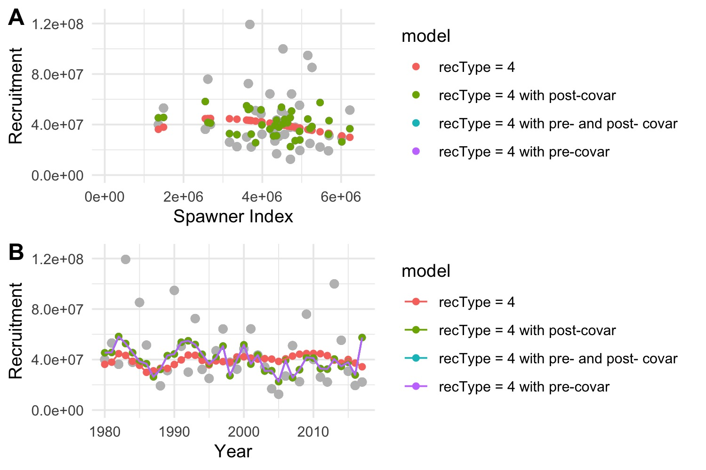

<!--   # html_notebook: -->
<!--   #   toc: TRUE -->
<!--   #   df_print: kable -->
<!--   #   fig_caption: yes -->
<!--   #   theme: flatly -->
<!--  rmarkdown:html_vignette -->
<!-- vignette: > -->
<!--   %\VignetteIndexEntry{futR documentation} -->
<!--   %\VignetteEngine{knitr::rmarkdown} -->
<!--   %\VignetteEncoding{UTF-8} -->

```{r setup1, echo = F,eval=T}
 knitr::opts_chunk$set(echo = TRUE,warning = FALSE, message = FALSE) 
 #knitr::opts_chunk$set(echo = TRUE)
 #source("R/01_make.R")       # loads packages, data, setup, etc.
 knitr::opts_knit$set(root.dir = '../')
 
```

```{r setup2, echo = F,eval=T}

 thisYr <- format(Sys.time(), "%Y")
 today  <- format(Sys.time(), "%b %d, %Y")
 
```

Repo maintained by:
Kirstin Holsman  
Alaska Fisheries Science Center  
NOAA Fisheries, Seattle WA  
**<kirstin.holsman@noaa.gov>**  
<!-- *Last updated: `r today`*   -->
   
---

<!-- # Overview {.tabset .tabset-dropdown} -->
# Overview

futR() is a generic Rpackage for fitting recruitment models to indices of spawning biomass (or numbers) and recruitment with or without climate covariates. The recruitment model is based on Template Model Builder (`TMB`) and standard stock-recruitment models modified to include the effects of environmental covariates (Deriso 1980; Schnute 1985). This includes Ricker (logistic), Beverton Holt, log-linear, and log-linear with biomass lagged by year 'y-1'. The model can be fit with and with out random effects on spawning stock biomass (SSB) and recruitment (R) (i.e., measurement error on SSB and rec) using the methods of  Porch and Lauretta (2016) and with the optional unbiased estimate of sigma (sensu Ludwid and Walters 1981, Porch and Lauretta 2016). Environmental covariates are optional and can be included to influence pre-spawning and post-spawning success. In all cases, parameters are estimated by minimizing the negative log-likelihood function:

$$-\mathrm{LL} = 0.5\left( n\mathrm{ln(2\pi\sigma^2_R)+\sum_{i=1}^{n_y}{\left( \frac{\mathrm{ln}(\frac{R_i}{\hat{R_i}})}{\sigma_R} \right)^2}} \right)$$ 

For more information see Holsman et al. 2020 Climate and trophic controls on groundfish recruitment in Alaska.
   
---

# futR() options

## Recruitment models (rectype)  {.tabset}

There are four base model formulations available for estimating the relationship between recruitment and spawners (and/ or environmental factors). The simplest includes linear models, as well as Ricker and Beverton-Holt spawner recruitment relationships. These are invoked using the input of "rectype" in the model function. 

1. Log-linear
2. Log-linear with spawners
3. Beverton Holt
4. Ricker

In addition, the main effect of environmental covariates is optional through estimating $\beta$ (for pre-larval or spawning habitat effects) and $\lambda$ (for post-spawning success and survival to recruitment age (e.g., age 0+ survival)):

* $\beta$  = vector $(1,n_{cov})$ of covariate effects on pre-larval/ effective number of spawners
* $\lambda$ = vector $(1,n_{cov})$ of covariate effects on post-spawning success (e.g., age 0+ survival)
* $\beta_0$  = binary $(0,1)$ vector $(1,n_{cov})$ of inclusion in pre-larval effects
* $\lambda_0$ = binary $(0,1)$ vector $(1,n_{cov})$ of inclusion in pre-larval effects post-spawning success
 

### rectype = 1. Log-linear

When rectype is set to 1, the model fits a log-normal linear model without an index of spawners (i.e., the mean recruitment as a function of annual changes in environmental covariates, ${X}$). This model is best for evaluating recruitment variation when an index of spawners or spawning biomass is not available, or when recruitment is more strongly driven by environmental conditions than by spawning biomass (e.g., hatchery production).
The general formulation is as follows:

$$ \mathrm{ln}(\hat{R_i})= a+\sum_{k=1}^{n_k}{\theta_i^{\beta}\beta_k X_{k,i}}+\varepsilon_i $$  

where $\varepsilon_i$ represents a normally distributed independent random variable with mean 0 and variance $\sigma^2_R$ (i.e., $\varepsilon_i\sim \mathrm N(0,\sigma^2_R)$, $\mathrm a$ is the estimated intercept, ${X}$ is a matrix of environmental covariates, $\beta$ is a vector of estimated parameters representing covariate effects on mean recruitment, and ${\theta^{\beta}}$ is a binary vector of length $n_k$ of covariate inclusion. (i.e., ${\theta^{\beta}} \in \{0,1 \}$).
 
$$\mathbf{X} = \left[\begin{array}
{rrr}
x_{1,1} & \dots  & b_{1,n_y} \\
\vdots & \ddots & \vdots \\
x_{n_k,1} & \dots  & x_{n_k,n_y} 
\end{array}\right]
,\; \mathbf{\beta} = \left[\begin{array}
{rrr}
\beta_1 \\
\vdots  \\
\beta_{n_k} \\
\end{array}\right]
$$

### rectype = 2. Log-linear with spawners

When rectype is set to 2, the model fits a log-normal linear model as a function of the index of spawners $\hat{S_i}$ in the year $i$ and annual changes in environmental covariates, ${X}$):

$$\mathrm{ln}(\hat{R_i})= a + \sum_{k=1}^{n_k}{\theta_i^{\beta}\beta_k X_{k,i}}+ (b+\sum_{k=1}^{n_k}{\theta_i^{\lambda}\lambda_k X_{k,i}})* \hat{S_i}+\varepsilon_i$$

where $\varepsilon_i$ represents a normally distributed independent random variable with mean 0 and variance $\sigma^2_R$ (i.e., $\varepsilon_i\sim \mathrm N(0,\sigma^2_R)$, $\mathrm{a}$ is the estimated intercept, $\mathrm{b}$ is the estimated productivity or slope,$\mathbf{X}$ is a matrix of environmental covariates, where $\beta$ and $\lambda$ are vectors of estimated parameters representing covariate effects on pre- and post-spawning success, respectively, and and $\theta^{\beta}$ and $\theta^{\lambda}$ are binary vectors of length $n_k$ of covariate inclusion (i.e., ${\theta^{\beta}} \in \{0,1 \}$ and ${\theta^{\lambda}} \in \{0,1 \}$). Note that in most cases, setting $a =0$ is recommended $\hat{R_i}\sim0$ as $\hat{S_i}\to0$)

$$\mathbf{X} = \left[\begin{array}
{rrr}
x_{1,1} & \dots  & b_{1,n_y} \\
\vdots & \ddots & \vdots \\
x_{n_k,1} & \dots  & x_{n_k,n_y} 
\end{array}\right],\; 
\mathbf{\beta} = \left[\begin{array}
{rrr}
\beta_1 \\
\vdots  \\
\beta_{n_k} \\
\end{array}\right],\; 
\mathbf{\lambda} = \left[\begin{array}
{rrr}
\lambda_1 \\
\vdots  \\
\lambda_{n_k}\\
\end{array}\right]
$$

### rectype = 3. Beverton Holt

The Beverton-Holt model is appropriate “if there is a maximum abundance imposed by
food availability or space, or if the predator can adjust its predatory activity immediately to changes in prey
abundance” (Wootton 1990, p. 264).

When rectype is set to 3, the model fits a Beverton-Holt (Beverton and Holt, 1957)  model as a function of the index of spawners $\hat{S_i}$ in the year $i$ and annual changes in environmental covariates, ${X}$). This model is most appropriate when there is a limit to the capacity of the system to support recruitment (e.g., limits to spawning habitat or limits to available food resources). Inclusion of environmental covariates on each of the terms in the model can therefore be used to model annual variation in spawning habitat and carrying capacity (covariates on the $a$ term below) or environmental changes in other density dependent processes like predation or disease (covariates on the $b$ term below):


$$\hat{R_i}=\frac{ a \hat{S_i}e^{ \left( \sum_{k=1}^{n_k}{\theta_i^{\beta}\beta_k X_{k,i}} \right)}}{ 1+b\hat{S_i}e^{\left( \sum_{k=1}^{n_k}{\theta_i^{\lambda}\lambda_k X_{k,i}} \right) }}+e^{\varepsilon_i}$$

where $\varepsilon_i$ represents a normally distributed independent random variable with mean 0 and variance $\sigma^2_R$ (i.e., $\varepsilon_i\sim \mathrm N(0,\sigma^2_R)$, $\mathrm a$ is the estimated productivity at lower spawning numbers and b is the density-dependent parameter; the asymptote of the slope is approximately $a/b$ (Quinn II and Deriso 1999). As in other formulations, ${X}$ is a matrix of environmental covariates, $\beta$ and $\lambda$ are vectors of estimated parameters representing covariate effects on pre- and post-spawning success, respectively, and $\theta^{\beta}$ and $\theta^{\lambda}$ are binary vectors of length $n_k$ of covariate inclusion (i.e., ${\theta^{\beta}} \in \{0,1 \}$ and ${\theta^{\lambda}} \in \{0,1 \}$).

$$\mathbf{X} = \left[\begin{array}
{rrr}
x_{1,1} & \dots  & b_{1,n_y} \\
\vdots & \ddots & \vdots \\
x_{n_k,1} & \dots  & x_{n_k,n_y}
\end{array}\right],\;
\mathbf{\beta} = \left[\begin{array}
{rrr}
\beta_1 \\
\vdots  \\
\beta_{n_k} \\
\end{array}\right],\;
\mathbf{\lambda} = \left[\begin{array}
{rrr}
\lambda_1 \\
\vdots  \\
\lambda_{n_k}\\
\end{array}\right]
$$
   
### rectype = 4. Ricker

When rectype is set to 4 the model fits a  Ricker S/R curve. The Ricker model (Ricker,1954) is a dome shaped recruitment curve best used to describe populations with strong density dependence (e.g., cannibalism). The model estimates recruitment in  year $i$ and a function of the index of spawners contributing to that year's recruitment $\hat{S_i}$ (e.g., spawning biomass in year $i-1$). If specified, the model also includes the additional effects of annual changes in environmental conditions ${X}$); inclusion of environmental covariates on each of the terms in the model can therefore be used to model annual variation in spawning habitat and carrying capacity (covariates on the $a$ term below) or environmental changes in other density dependent processes like cannibalism (covariates on the $b$ term below):

$$\hat{R_i}= a\hat{S_i}e^{-b\hat{S_i}} e^{\varepsilon_i} $$

the general Ricker formulation can be rewritten in linear form and expanded to include covariates (modified from Mueter et al. 2011):

<!-- $$\mathrm{ln}\hat{R_i}= a \sum_{k=1}^{n_k}{\theta_i^{\beta}\beta_k X_{k,i}} -b\hat{S_i}\sum_{k=1}^{n_k}{\theta_i^{\lambda}\lambda_k X_{k,i}}+\mathrm{ln}\hat{S_i}+\varepsilon_i $$ -->

<!-- $$\mathrm{ln}\hat{R_i}= ae^{\left( \sum_{k=1}^{n_k}{\theta_i^{\beta}\beta_k X_{k,i}} \right)}-be^{\left( \sum_{k=1}^{n_k}{\theta_i^{\lambda}\lambda_k X_{k,i}}\right)}\hat{S_i}+\mathrm{ln}\hat{S_i}+\varepsilon_i $$ -->

$$\mathrm{ln}\hat{R_i}= \left(a+ \sum_{k=1}^{n_k}{\theta_i^{\beta}\beta_k X_{k,i}} \right)-\left(b+ \sum_{k=1}^{n_k}{\theta_i^{\lambda}\lambda_k X_{k,i}}\right)\hat{S_i}+\mathrm{ln}\hat{S_i}+\varepsilon_i$$

where $\varepsilon_i$ represents a normally distributed independent random variable with mean 0 and variance $\sigma^2_R$ (i.e., $\varepsilon_i\sim \mathrm N(0,\sigma^2_R)$, $\mathrm a$ is the estimated slope of the model near $\hat{S_i}\sim0$ and b is the density-dependence shape parameter. ${X}$ is a matrix of environmental covariates, $\beta$ and $\lambda$ are vectors of estimated parameters representing covariate effects on pre- and post-spawning success, respectively,and $\theta^{\beta}$ and $\theta^{\lambda}$are binary vectors of length $n_k$ of covariate inclusion (i.e., ${\theta^{\beta}} \in \{0,1 \}$ and ${\theta^{\lambda}} \in \{0,1 \}$).

$$\mathbf{X} = \left[\begin{array}
{rrr}
x_{1,1} & \dots  & b_{1,n_y} \\
\vdots & \ddots & \vdots \\
x_{n_k,1} & \dots  & x_{n_k,n_y}
\end{array}\right],\;
\mathbf{\beta} = \left[\begin{array}
{rrr}
\beta_1 \\
\vdots  \\
\beta_{n_k} \\
\end{array}\right],\;
\mathbf{\lambda} = \left[\begin{array}
{rrr}
\lambda_1 \\
\vdots  \\
\lambda_{n_k}\\
\end{array}\right]
$$


---

## Obs. error options (sigMethod)  {.tabset}

Finally, for more advanced model fitting, various options for observation error on recruitment or spawning estimates is available through alternative "sigMethod" selections:

1. No observation error ($\tau=0$)
2. estimate sigma, random effects on SSB if $\tau>0$, $\tau$ input
3. as in 1 but with unbiased sigma estimate, $\tau$ input
4. as in 1 but with defined measurement error for rec (indep of random effects on Spawners/SSB)
5. as in 1 but with  defined measurement error for rec and Spawners/SSB)

### sigMethod = 1

The base model fits the lognormally distributed process error for recruitment ($\sigma$) using maximum likelihood (i.e., ordinary least squares). When sigMethod - 0, no observation error ($\tau = 0$) is estimated for either spawners (S) or recruitment (R) estimates:

$log\hat{R}_i\sim N(0,\sigma_R)$ where $\sigma_R=\sigma$

Similarly, spawner indices ($\hat{S}_{i-1}$) include log-normally distributed observation error as:
$log\hat{S}_{i-1} \sim N(0,\sigma_S)$ where $\sigma_S=0$


### sigMethod = 2

The base model fits the lognormally distributed process error for recruitment ($\sigma$) using maximum likelihood (i.e., ordinary least squares). Additionally, when sigMethod = 1 and $\tau$ is input ($0<\tau<1$), observation errors are estimated for recruitment and spawners. Observation errors are statistically independent, random normal variables with similar variance but because of lack of other information $\sigma_R$ is modeled as a function of process error via the $\tau$ scalar (see eq 4 in Porch, C. E., and M. V. Lauretta. 2016). Observation error for recruitment is modeled with log-normally distributed observation error as a function of $\sigma$ as:
$log\hat{R}_i\sim N(0,\sigma_R)$ where $\sigma_R=(1+\tau)*\sigma$

Similarly, spawner indices ($\hat{S}_{i-1}$) include log-normally distributed observation error as:
$log\hat{S}_{i-1} \sim N(0,\sigma_S)$ where $\sigma_S=\tau*\sigma$


### sigMethod = 3

As in sigMethod = 2, except when sigMethod = 3 $\sigma$ is estimated using the unbiased sigma estimate (sensu Ludwig and Walters 1982):

$$\sigma_i =  \frac1{(n_y-k)}*({ \frac{{\epsilon_{Ri}}^2}{1+\tau} + \frac{{\epsilon_{S,i}}^2}{\tau} })$$
where

  $$\epsilon_{Ri} = log(R_i) - log(\hat R_i) $$
  and
   $$\epsilon_{Si} = log(S_i) - log(\hat S_i) $$

### sigMethod = 4

As in sigMethod = 2 with observation error (random effects) on S if $\tau >0$,  but with defined measurement error ($\gamma_{R,i}$) for recruitment estimates (independent of random effects on spawners) such that:

  $log\hat{R}_i\sim N(0,\sigma_R)$  where $\sigma_{R,i}=\sigma_i+\gamma_{R,i})$.
 and
 $log\hat{S}_{i-1} \sim N(0,\sigma_S$ where $\sigma_S=\tau*\sigma$.


### sigMethod = 5

As in sigMethod = 2 with observation error (random effects) on S and R if $\tau >0$,  but with defined measurement errors ($\gamma_{R,i}$ and $\gamma_{S,i}$) for recruitment and spawner estimates (independent of random effects on spawners) such that:

  $log\hat{R}_i\sim N(0,\sigma_R)$  where $\sigma_{R,i}=((1+\tau)*\sigma_i)+\gamma_{R,i}$.
 and
 $log\hat{S}_{i-1} \sim N(0,\sigma_S$ where $\sigma_S=(\tau*\sigma)+\gamma_{S,i}$.

Note that $\tau = 0$ defaults to the input variance for S and R as offsets for each.
   
{width=80%}

---


# Running futR() 

## Getting started {.tabset}
### Step 1: Installing futR()

The package can be installed from github using the devtools package:

```{r devtools, echo=T,eval=F}
install.packages("devtools")
```

The projection package can then be installed to R directly:

```{r install, echo=T,eval=F}
devtools::install_github("kholsman/futR")
```

### Step 2: Set up the workspace

The base function for fitting recruitment requires a data.frame of recruitment and spawning biomass:

```{r setup, echo=T,eval=T,message=F,results='hide'}
  # rm(list=ls()); setwd("/Users/kholsman/Documents/GitHub/futR")
  #___________________________________________
  # 1. Set things up
  #___________________________________________
  # rm(list=ls()) ; dir()

  # load data, packages, setup, etc.
  source("R/01_make.R")

  #___________________________________________
  # 2. Compile futR	(first time through - can skip this step after )
  #___________________________________________

  recompile_model <- FALSE # to recompile the model set to TRUE

   if(recompile_model){
    wd0 <- getwd()
    setwd("src/TMB")
      recompile('futR')
    setwd(wd0)
   }
  # this will generate warnings - they can be ignored if "0" is returned

```

*Note: If you get a compilation error try reinstalling RTools using the instructions [here](https://cran.r-project.org/bin/windows/Rtools/).*
      
```{r setup3, echo=T,eval=T,message=F,results='hide'}
  
 # read in the data and create a datlist
  datlist <- makefutR_data("data/in/futR_Inputs.xlsx" )
  
  # recruitment data:
  datlist$rs_dat$R_obs
  datlist$rs_dat$S_obs
  
  # covar data:
  datlist$rs_dat$rs_cov
  # rec        <-  rec_dat[[1]]
  # env        <-  env_covars

  # which parameters to estimate with futR?
  datlist$estparams
  
  # starting values? 
  datlist$parameters
  
  # parameter map:
  datlist$maplist
  
  # which phases to estimate in (not yet coded up)
  datlist$phases

 
  # set some global values for the demo below:
  estparams <-  datlist$estparams[1:6]
  rec       <-  data.frame(readxl::read_xlsx("data/in/futR_Inputs.xlsx" , sheet = "rec_data" ))

  
```

## Explore recruitment models {.tabset}

### rectype = 1

Log-linear relationship (mean with variation with covars).
$$ \mathrm{log}(\hat{R_i})= a+\sum_{k=1}^{n_k}{\theta_i^{\beta}\beta_k X_{k,i}}+\varepsilon_i $$

```{r fitR1, echo=T,eval=T,message=F,results='hide'}

  # makeDat will make the input values, data, and phases for the model:
  
  # hand code datlist:
  datlist  <-  makeDat(
                    rectype    =  1,
                    tauIN      =  0,
                    sigMethod  =  1, # (default, no random effects)
                    estparams  =  estparams,
                    estMode    =  1,
                    rec_years  =  rec$rec_year,
                    Rec        =  rec$Robs,
                    SSB        =  rec$SSB,
                    sdSSB      =  rec$sdSSB,
                    sdRec      =  rec$sdRobs,
                    covars     =  NULL,
                    covars_sd  =  NULL)

  # run the basic model
  Rec1 <-  mm <-runRecMod(dlistIN   = datlist,
                          version   = 'futR',
                          recompile = FALSE,
                          simulate  = TRUE,
                          sim_nitr  = 1000)
   # summarize results
  dfR1    <-  data.frame(model = "Rec 1",
                     estimate  = as.vector(mm$sim),
                     parameter = names( mm$mle)[row(mm$sim)])
  df      <- dfR1
  r1_fit  <- getFit(mm, nm = "recType = 1")
  rec_fit <- r1_fit
  rm(mm)
  
  if(1 == 10){
   print(rec_fit)
   jpeg("Figs/recplot1.jpg")
   print(plot_rs(rec_fit))
   dev.off()
  }
   

```

```{r plotR1, fig.dim=c(8, 8),echo=F}
   #plot_par_pdf(dfR1_t1)
   plot_rs(rec_fit)

```


### rectype = 2

Log-linear relationship with spawners and covariates.

$$\mathrm{log}(\hat{R_i})= a + \sum_{k=1}^{n_k}{\theta_i^{\beta}\beta_k X_{k,i}}+ (b+\sum_{k=1}^{n_k}{\theta_i^{\lambda}\lambda_k X_{k,i}})* \hat{S_i}+\varepsilon_i$$

```{r fitR2, echo=T,eval=T,message=F,results='hide'}

  # makeDat will make the input values, data, and phases for the model:
  estparams1 <- estparams
  estparams1["log_a"] <- FALSE
  startVal_1     <-   list(log_a = -Inf) # force 0 intercept
  datlist  <-  makeDat(
                    rectype    =  2,
                    tauIN      =  0,
                    sigMethod  =  1, # (default, no random effects)
                    estparams  =  estparams1, # set to estparams to allow est of log_a
                    startVal   =  startVal_1, # set to NULL to remove 0 intercept
                    estMode    =  1,
                    rec_years  =  rec$rec_year,
                    Rec        =  rec$Robs,
                    SSB        =  rec$SSB,
                    sdSSB      =  rec$sdSSB,
                    sdRec      =  rec$sdRobs,
                    covars     =  NULL,
                    covars_sd  =  NULL)

  # run the basic model
  Rec2 <-  mm <-runRecMod(dlistIN   = datlist,
                          version   = 'futR',
                          recompile = FALSE,
                          simulate  = TRUE,
                          sim_nitr  = 1000)
  # summarize results
  dfR2    <-  data.frame(model = "Rec 2",
                     estimate  = as.vector(mm$sim),
                     parameter = names( mm$mle)[row(mm$sim)])
  df      <- rbind(dfR1,dfR2)
  r2_fit  <- getFit(mm, nm = "recType = 2")
  rec_fit <- rbind(rec_fit,r2_fit)
 rm(mm)
 if(1==10){
   jpeg("Figs/recplot2.jpg")
   print(plot_rs(rec_fit))
   dev.off()
 }

```

```{r plotR2, fig.dim=c(8, 8),echo=F}
   #plot_par_pdf(df)
   plot_rs(rec_fit)

```

### rectype = 3

Beverton holt relationship.
<!-- $\gamma = 0$ -->

<!-- $$R_i  =  aS_ie^{\mathbf{\beta X}}{(1 - (b\gamma S_ie^{\mathbf{\beta X}})}^{1/\gamma})e^{\mathbf{\lambda X}}*e^{\sigma}$$ -->

$$\hat{R_i}=\frac{ a \hat{S_i}e^{ \left( \sum_{k=1}^{n_k}{\theta_i^{\beta}\beta_k X_{k,i}} \right)}}{ 1+b\hat{S_i}e^{\left( \sum_{k=1}^{n_k}{\theta_i^{\lambda}\lambda_k X_{k,i}} \right) }}+e^{\varepsilon_i}$$


```{r fitR3, echo=T,eval=T,message=F,results='hide'}

  # makeDat will make the input values, data, and phases for the model:
  datlist  <-  makeDat(
                    rectype    =  3,
                    tauIN      =  0,
                    sigMethod  =  1, # (default, no random effects)
                    estparams  =  estparams,
                    estMode    =  1,
                    rec_years  =  rec$rec_year,
                    Rec        =  rec$Robs,
                    SSB        =  rec$SSB,
                    sdSSB      =  rec$sdSSB,
                    sdRec      =  rec$sdRobs,
                    covars     =  NULL,
                    covars_sd  =  NULL)

  # run the basic model
  Rec3 <-  mm <-runRecMod(dlistIN   = datlist,
                          version   = 'futR',
                          recompile = FALSE,
                          simulate  = TRUE,
                          sim_nitr  = 1000)
  # summarize results
  dfR3    <-  data.frame(model = "Rec 3",
                     estimate  = as.vector(mm$sim),
                     parameter = names( mm$mle)[row(mm$sim)])
  df      <- rbind(df,dfR3)
  r3_fit  <- getFit(mm, nm = "recType = 3")
  rec_fit <- rbind(rec_fit,r3_fit)
  rm(mm)
  
  if(1==10){
     jpeg("Figs/recplot3.jpg")
     print(plot_rs(rec_fit))
     dev.off()
  }

```

```{r plotR3, fig.dim=c(8, 8),echo=F}
   #plot_par_pdf(df)
   plot_rs(rec_fit)

```


### rectype = 4

Ricker relationship.

<!-- $$\mathrm{ln}\hat{R_i}= ae^{\left( \sum_{k=1}^{n_k}{\theta_i^{\beta}\beta_k X_{k,i}} \right)}-be^{\left( \sum_{k=1}^{n_k}{\theta_i^{\lambda}\lambda_k X_{k,i}}\right)}\hat{S_i}+\mathrm{ln}\hat{S_i}+\varepsilon_i $$ -->
$$\mathrm{ln}\hat{R_i}= \left(a+ \sum_{k=1}^{n_k}{\theta_i^{\beta}\beta_k X_{k,i}} \right)-\left(b+ \sum_{k=1}^{n_k}{\theta_i^{\lambda}\lambda_k X_{k,i}}\right)\hat{S_i}+\mathrm{ln}\hat{S_i}+\varepsilon_i $$


```{r fitR4, echo=T,eval=T,message=F,results='hide'}

  # makeDat will make the input values, data, and phases for the model:
  datlist  <-  makeDat(
                    rectype    =  4,
                    tauIN      =  0,
                    sigMethod  =  1, # (default, no random effects)
                    estparams  =  estparams,
                    estMode    =  1,
                    rec_years  =  rec$rec_year,
                    Rec        =  rec$Robs,
                    SSB        =  rec$SSB,
                    sdSSB      =  rec$sdSSB,
                    sdRec      =  rec$sdRobs,
                    covars     =  NULL,
                    covars_sd  =  NULL)

  # run the basic model
  Rec4 <-  mm <-runRecMod(dlistIN   = datlist,
                          version   = 'futR',
                          recompile = FALSE,
                          simulate  = TRUE,
                          sim_nitr  = 1000)

  # summarize results
  dfR4    <-  data.frame(model = "Rec 4",
                     estimate  = as.vector(mm$sim),
                     parameter = names( mm$mle)[row(mm$sim)])
  df      <- rbind(df,dfR3)
  r4_fit  <- getFit(mm, nm = "recType = 4")
  rec_fit <- rbind(rec_fit,r4_fit)
 rm(mm)
 jpeg("Figs/recplot4.jpg")
 print(plot_rs(rec_fit))
 dev.off()

```

```{r plotR4, fig.dim=c(8, 8),echo=F}
   #plot_par_pdf(df)
   plot_rs(rec_fit)

```


### rectype = 4 with covariates

Ricker relationship fit with covariates on pre-spawning success and post-spawning survival.

<!-- $$\mathrm{log}\hat{R_i}= a\left( \sum_{k=1}^{n_k}{\theta_i^{\beta}\beta_k X_{k,i}} \right)-b\hat{S_i}\sum_{k=1}^{n_k}{\theta_i^{\lambda}\lambda_k X_{k,i}}+\mathrm{ln}\hat{S_i}+\varepsilon_i $$ -->

$$\mathrm{ln}\hat{R_i}= \left(a+ \sum_{k=1}^{n_k}{\theta_i^{\beta}\beta_k X_{k,i}} \right)-\left(b+ \sum_{k=1}^{n_k}{\theta_i^{\lambda}\lambda_k X_{k,i}}\right)\hat{S_i}+\mathrm{ln}\hat{S_i}+\varepsilon_i $$

```{r fitR4_2, echo=T,eval=T,message=F,results='hide'}
 
  
  # read in the data and create a datlist (rather than hand code it)
  datlist <- makefutR_data("data/in/futR_Inputs.xlsx" )
  
  
  # run the basic model
  Rec4_covar <-  mm <-runRecMod(dlistIN   = datlist,
                          version   = 'futR',
                          recompile = FALSE,
                          simulate  = TRUE,
                          sim_nitr  = 1000)

  # summarize results
  dfR4_c    <-  data.frame(model = "Rec 4 with covar",
                     estimate  = as.vector(mm$sim),
                     parameter = names( mm$mle)[row(mm$sim)])
  df      <- rbind(dfR4,dfR4_c)
  r4_fit_c  <- getFit(mm, nm = "recType = 4 with covar")
  rec_fit <- rbind(r4_fit,r4_fit_c)
 rm(mm)
 jpeg("Figs/recplot5.jpg")
 print(plot_rs(rec_fit))
 dev.off()

```

```{r plotR4_cov, fig.dim=c(8, 8),echo=F}
   #plot_par_pdf(df)
   plot_rs(rec_fit)

```


<!-- # ```{r plotR4_covpar, fig.dim=c(10, 4),echo=F} -->
<!-- #   # now plot the density of each parm: -->
<!-- #   plot_par_pdf(df) -->
<!-- # ``` -->
<!-- #  -->

## Explore obs. error options  {.tabset}

Let's start by fitting based models (no climate covariates) with different options for observation error.

1. No observation error (tau = 0)
2. estimate sigma, random effects on SSB if tau >0, tau input
3. unbiased sigma estimate, tau input
4. as in 1 but with defined measurement error for rec (indep of random effects on Spawners/SSB)
5. as in 1 but with  defined measurement error for rec and Spawners/SSB)

**Run this code first**

```{r base, echo=T,eval=T,message=F,results='hide'}

   estparams  = c(
    log_a        = TRUE,
    log_b        = TRUE,
    beta         = FALSE,  # no env covariate
    lambda       = FALSE,  # no env covariate
    epsi_s       = TRUE,
    logsigma     = TRUE)

   rectype_use <- 4 # recType to use (Ricker)

```


Now explore different sigMethod settings starting with sigMethod = 0. Note comparitive plots at the bottom of each tab.

### sigMethod = 1

The base model fits the lognormally distributed process error for recruitment ($\sigma$) using maximum likelihood (i.e., ordinary least squares). When sigMethod =1 , no observation error ($\tau = 0$) is estimated for either spawners (S) or recruitment (R) estimates.

```{r fit1, echo=T,eval=T,message=F,results='hide'}

  # makeDat will make the input values, data, and phases for the model:
  datlist  <-  makeDat(
                    tauIN      =  0,  # set tau to zero (no random effects)
                    sigMethod  =  1,
                    estparams  =  estparams,
                    rectype    =  rectype_use, #Ricker
                    rec_years  =  rec$rec_year,
                    Rec        =  rec$Robs,
                    SSB        =  rec$SSB,
                    sdSSB      =  rec$sdSSB,
                    sdRec      =  rec$sdRobs,
                    covars     =  NULL,
                    covars_sd  =  NULL)

  # run the basic model

  m_S1 <-  mm <-runRecMod(dlistIN   = datlist,
                       version   = 'futR',
                       recompile = F,
                       simulate  = TRUE,
                       sim_nitr  = 1000)

  df_S1 <-  data.frame(model = "sigMethod 1",
                     estimate=as.vector(mm$sim),
                     parameter=names( mm$mle)[row(mm$sim)])
  rm(mm)

  mu   <- df_S1%>%group_by(model,parameter)%>%summarise(grp.mean=mean(estimate))
  peak <- df_S1%>%group_by(model,parameter)%>%
    count(parameter,round(estimate,1))%>%
    slice(which.max(n))
  names(peak)<- c("model","parameter","freq","n")
 jpeg("Figs/plotpar1.jpg")
 print(plot_par_pdf(df_S1))
 dev.off()
```

```{r plot1, fig.dim=c(10, 4),echo=F}
  # now plot the density of each parm:
  plot_par_pdf(df_S1)
```


### sigMethod = 2


The base model fits the lognormally distributed process error for recruitment ($\sigma$) using maximum likelihood (i.e., ordinary least squares). Additionally, when sigMethod = 2 and $\tau$ is input ($0<\tau<1$), observation errors are estimated for recruitment and spawners. Observation errors are statistically independent, random normal variables with similar variance but because of lack of other information $\sigma_R$ is modeled as a function of process error via the $\tau$ scalar (see eq 4 in Porch, C. E., and M. V. Lauretta. 2016). Observation error for recruitment is modeled with log-normally distributed observation error as a function of $\sigma$ as:
$log\hat{R}_i\sim N(0,\sigma_R)$ where $\sigma_R=(1+\tau)*\sigma$

Similarly, spawner indices ($\hat{S}_{i-1}$) include log-normally distributed observation error as:
$log\hat{S}_{i-1} \sim N(0,\sigma_S)$ where $\sigma_S=\tau*\sigma$

```{r fit2, echo=T,eval=T,message=F,results='hide'}

  # makeDat will make the input values, data, and phases for the model:
  datlist  <-  makeDat(
                    tauIN      =  1,
                    sigMethod  =  2,
                    estparams  =  estparams,
                    rectype    =  rectype_use, #Ricker
                    rec_years  =  rec$rec_year,
                    Rec        =  rec$Robs,
                    SSB        =  rec$SSB,
                    sdSSB      =  rec$sdSSB,
                    sdRec      =  rec$sdRobs,
                    covars     =  NULL,
                    covars_sd  =  NULL)

  # re-run the model with tau

  m_S2  <-  mm <-  runRecMod(dlistIN  = datlist,
                          version  = 'futR',
                          recompile= F,
                          simulate = TRUE,
                          maxitr   = 100000,
                          maxeval  = 100000,
                          sim_nitr = 1000)

  df_S2 <-  data.frame(model = "sigMethod 2",
                    estimate   = as.vector(mm$sim),
                    parameter  = names( mm$mle)[row(mm$sim)])
  rm(mm)
  df <- rbind(df_S1, df_S2)
  mu   <- df%>%group_by(model,parameter)%>%summarise(grp.mean=mean(estimate))
  peak <- df%>%group_by(model,parameter)%>%
    count(parameter,round(estimate,1))%>%
    slice(which.max(n))
  names(peak)<- c("model","parameter","freq","n")
jpeg("Figs/plotpar2.jpg")
 print(plot_par_pdf(df))
 dev.off()


```

```{r plot2, fig.dim=c(10, 4),echo=F}
  # now plot the density of each parm:
  plot_par_pdf(df)
```

### sigMethod = 3

As in sigMethod = 2, except when sigMethod = 3 $\sigma$ is estimated using the unbiased sigma estimate (sensu Ludwig and Walters 1982):

$$\sigma_i =  \frac1{(n_y-k)}*({ \frac{{\epsilon_{Ri}}^2}{1+\tau} + \frac{{\epsilon_{S,i}}^2}{\tau} })$$
where

  $$\epsilon_{Ri} = log(R_i) - log(\hat R_i) $$
  and
   $$\epsilon_{Si} = log(S_i) - log(\hat S_i) $$

```{r fit3, echo=T,eval=T,message=F,results='hide'}
  # makeDat will make the input values, data, and phases for the model:
   datlist  <-  makeDat(
                    tauIN      =  .001,
                    sigMethod  =  3,
                    #tMethod    =  tm_use, #cloglog link (g = 1-exp(-exp(gamma)))
                    estparams  =  estparams,
                    rectype    =  rectype_use, #Ricker
                    rec_years  =  rec$rec_year,
                    Rec        =  rec$Robs,
                    SSB        =  rec$SSB,
                    sdSSB      =  rec$sdSSB,
                    sdRec      =  rec$sdRobs,
                    covars     =  NULL,
                    covars_sd  =  NULL)


  # re-run the model with tau

  m_S3 <-  mm <- runRecMod(dlistIN   = datlist,
                        version   = 'futR',
                        recompile = F,
                        simulate  = TRUE,
                        sim_nitr  = 1000)

  df_S3 <-  data.frame(model = "sigMethod 3",
                     estimate=as.vector(mm$sim),
                     parameter=names( mm$mle)[row(mm$sim)])
  rm(mm)

  df <- rbind(df, df_S3)
  mu   <- df%>%group_by(model,parameter)%>%summarise(grp.mean=mean(estimate))
  peak <- df%>%group_by(model,parameter)%>%
    count(parameter,round(estimate,1))%>%
    slice(which.max(n))
  names(peak)<- c("model","parameter","freq","n")
  jpeg("Figs/plotpar3.jpg")
  print(plot_par_pdf(df))
  dev.off()

```


```{r plot3, fig.dim=c(10, 4),echo=F}
  # now plot the density of each parm:
  plot_par_pdf(df)
```


### sigMethod = 4

As in sigMethod = 2 with observation error (random effects) on S if $\tau >0$,  but with defined measurement error ($\gamma_{R,i}$) for recruitment estimates (independent of random effects on spawners) such that:

  $log\hat{R}_i\sim N(0,\sigma_R)$  where $\sigma_{R,i}=\sigma_i+\gamma_{R,i}$.
 and
 $log\hat{S}_{i-1} \sim N(0,\sigma_S$ where $\sigma_S=\tau*\sigma$.


```{r fit4, echo=T,eval=T,message=F,results='hide'}
  # makeDat will make the input values, data, and phases for the model:
   datlist  <-  makeDat(
                    tauIN      =  .03,
                    sigMethod  =  4,
                    #tMethod    =  tm_use, #cloglog link (g = 1-exp(-exp(gamma)))
                    estparams  =  estparams,
                    rectype    =  rectype_use, #Ricker
                    rec_years  =  rec$rec_year,
                    Rec        =  rec$Robs,
                    SSB        =  rec$SSB,
                    sdSSB      =  rec$sdSSB,
                    sdRec      =  rec$sdRobs,
                    covars     =  NULL,
                    covars_sd  =  NULL)

  # re-run the model with tau
  m_S4 <-  mm <- runRecMod(dlistIN=datlist,version='futR',recompile=F,simulate=TRUE,sim_nitr = 1000)

  df_S4 <-  data.frame(model = "sigMethod 4",
                     estimate=as.vector(mm$sim),
                     parameter=names( mm$mle)[row(mm$sim)])
  rm(mm)

  df <- rbind(df, df_S4)
  mu   <- df%>%group_by(model,parameter)%>%summarise(grp.mean=mean(estimate))
  peak <- df%>%group_by(model,parameter)%>%
    count(parameter,round(estimate,1))%>%
    slice(which.max(n))
  names(peak)<- c("model","parameter","freq","n")
  jpeg("Figs/plotpar4.jpg")
  print(plot_par_pdf(df))
  dev.off()

```

```{r plot4, fig.dim=c(10, 4),echo=F}
  # now plot the density of each parm:
  plot_par_pdf(df)
```


### sigMethod = 5

As in sigMethod = 2 with observation error (random effects) on S and R if $\tau >0$,  but with defined measurement errors ($\gamma_{R,i}$ and $\gamma_{S,i}$) for recruitment and spawner estimates (independent of random effects on spawners) such that:

  $log\hat{R}_i\sim N(0,\sigma_R)$  where $\sigma_{R,i}=((1+\tau)*\sigma_i)+\gamma_{R,i}$.
 and
 $log\hat{S}_{i-1} \sim N(0,\sigma_S$ where $\sigma_S=(\tau*\sigma)+\gamma_{S,i}$.

Note that $\tau = 0$ defaults to the input variance for S and R as offsets for each.


```{r fit5, echo=T,eval=T,message=F,results='hide'}
  # makeDat will make the input values, data, and phases for the model:
   datlist  <-  makeDat(
                    tauIN      =  .03,
                    sigMethod  =  5,
                    #tMethod    =  tm_use, #cloglog link (g = 1-exp(-exp(gamma)))
                    estparams  =  estparams,
                    rectype    =  rectype_use, #Ricker
                    rec_years  =  rec$rec_year,
                    Rec        =  rec$Robs,
                    SSB        =  rec$SSB,
                    sdSSB      =  rec$sdSSB,
                    sdRec      =  rec$sdRobs,
                    covars     =  NULL,
                    covars_sd  =  NULL)


  # re-run the model with tau

  m_S5 <-  mm <- runRecMod(dlistIN=datlist,version='futR',recompile=F,simulate=TRUE,sim_nitr = 1000)

  df_S5 <-  data.frame(model = "sigMethod 5",
                     estimate=as.vector(mm$sim),
                     parameter=names( mm$mle)[row(mm$sim)])
  rm(mm)

  df <- rbind(df, df_S5)
  jpeg("Figs/plotpar5.jpg")
 print(plot_par_pdf(df))
 dev.off()
  

```

```{r plot5, fig.dim=c(10, 4),echo=F}
  # now plot the density of each parm:
  plot_par_pdf(df)
```


```{r makeReadME, echo=FALSE,eval=F, include =F}

# source("R/make.R")
 # copy and paste this into R window (won't work within markdown)

 rmd2md(rmd_fl = "vingettes/futR_demo",md_fl = "README")


```


